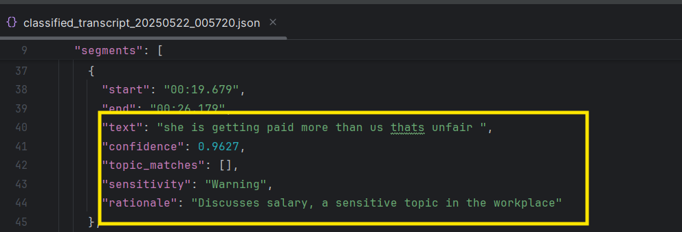
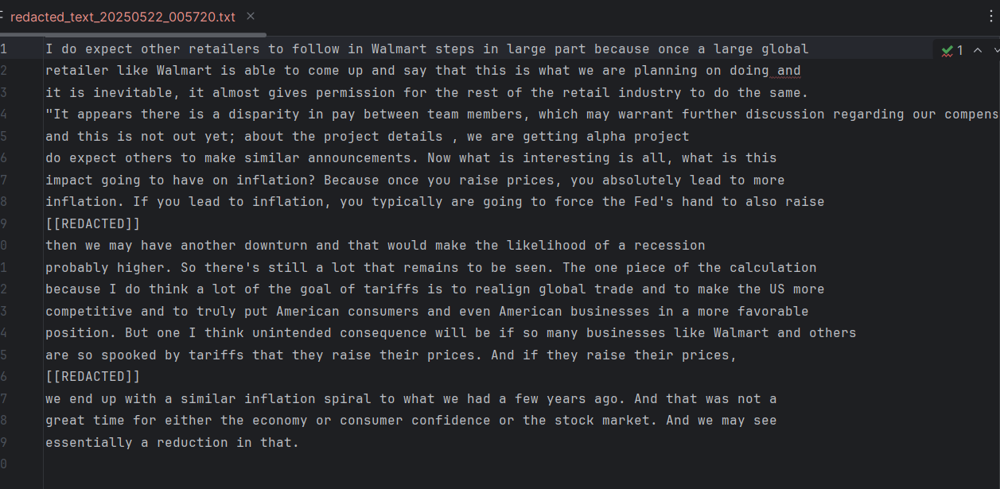
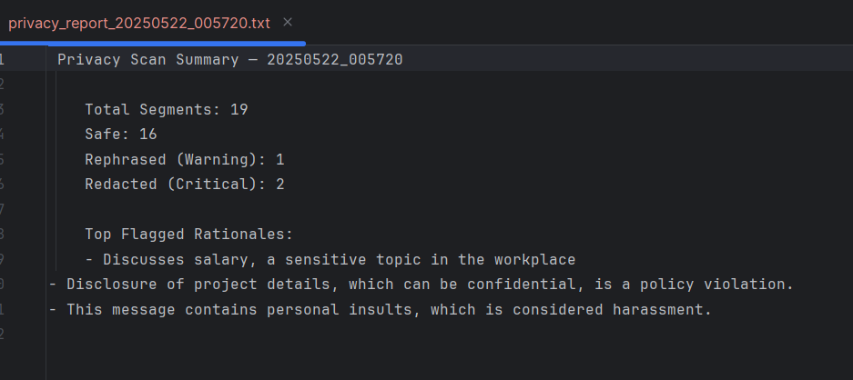

# 🔒 Smart Audio Firewall

## 📚 Table of Contents

* [Overview](#overview)
* [Features](#features)
* [Architecture](#architecture)
* [Implementation Details](#implementation-details)
* [Repository Structure](#repository-structure)
* [Prerequisites](#prerequisites)
* [How to Get Started](#how-to-get-started)
* [Logging](#logging)
* [Limitations](#limitations)
* [Future Enhancements](#future-enhancements)
* [Results](#results)
* [License](#license)

---

## 🧽 Overview

Smart Audio Firewall is an AI-driven system that listens to ambient conversations — in physical rooms, video calls, or recorded meetings — and **intelligently flags, redacts ** content based on user-defined sensitive topics or trigger phrases.

It acts as an **AI content compliance filter**, alerting users when private or inappropriate speech is detected — even if indirectly phrased.

---
## ✨ Features

* 🎹 **Multi-source Audio Input** – Mic, MP3/WAV, MP4
* 🧠 **ASR via Whisper** – Converts speech to structured text
* 🌐 **Language Detection** – Automatically detects and flags non-English language use
* ⚠️ **Sensitive Content Flagging**:
  * `Safe`: Acceptable content
  * `Warning`: Possibly sensitive, rephrased
  * `Critical`: Redacted
* ✂️ **Redacted Output** – Critical content is removed
* 🧾 **Reason Logging** – Flags include rationale for decisions
* 📋 **Transcript Output** – Full text output (raw and redacted)
* 📄 **Reports** – Generates  JSON, and TXT summaries
* 🖥️ **Multiple Interfaces** – CLI, Tkinter GUI, and Streamlit Web UI(In Progress)

---

## 🛡️ Architecture

```
Audio Input (Mic/File)
     ↓
Audio Recorder / Loader
     ↓
Whisper Transcriber
     ↓
Ollama + Mistral (LLM)
     ↓
Segment Classification
     ↓
Redaction / Rephrasing
     ↓
 TXT / JSON Outputs
```

> 📌 All outputs are logged and timestamped. Each segment includes confidence score, flag, and reasoning.

---
## 📘 Full Architecture & Design Rationale

Want to understand how this system was built, why I made key decisions, and how I moved from embeddings to LLM-based classification?

🔗 [Read the detailed Notion write-up](https://ruby-quotation-9e7.notion.site/Smart-Audio-Firewall-Architecture-Rationale-1fc2c68ffe0780c3a5bbcc581deb61b1)

## 🛠 Implementation Details

* **Whisper**: Converts audio to timestamped segments
* **Ollama + Mistral LLM**: Classifies and rewrites flagged text
* **FFmpeg**: Converts formats (e.g., MP4 to MP3)
* **PDF Report**: Built via `fpdf`
* **Logs**: Written to console and file
* **Outputs**: Structured as text, JSON outputs

---

## 📁 Repository Structure
```
ProjectChallenge1/
├── app/
│   ├── audio_input/
│   │   ├── Audio_Recording.py      # Mic or file input
│   │   └── Transcriber.py          # Whisper transcription
│   └── text_input/
│   │   └── llm_handler.py          # LLM-based classification and redaction
│   ├── main.py                     # Streamlit implementation
├── audio_data/
│   └── audio_files/                # Uploaded and recorded audio
├── logs/                           # Application logs
├── Outputs/                        # Redacted results, reports
├── temp_uploads/                   # Intermediate storage
├── utils/
│   ├── helpers.py                  # PDF & format utilities
│   ├── json_io.py                  # JSON load/save
│   ├── logger.py                   # Logging setup
│   └── paths.py                    # Folder and path management
│
├── run.py                          # CLI interface
├── start_app.py                    # Streamlit entry
├── start_gui.py                    # Tkinter desktop GUI

```
---

## ⚙️ Prerequisites

* Python 3.10+
* [FFmpeg](https://ffmpeg.org/download.html)
* [Ollama](https://ollama.com/download)
* `pyaudio` for microphone input

---

## 🚀 How to Get Started

### Note : Create a Virtual Environment to avoid dependency errors

```bash
python -m venv venv 
.venv\Scripts\activate
```
### 1. Install dependencies

```bash
pip install -r requirements.txt
```

### 2. Start Ollama and load a model

```bash
ollama serve
ollama run mistral
```

### 3. Run the app

#### CLI

```bash
python run.py --use-file ./example.mp3 --topics salary gossip harassment 
python run.py --> To record audio
```

#### Tkinter GUI

```bash
python start_gui.py
```

#### Streamlit Web UI (In Progress: Not Recommended as of now because of the web timed out errors due to latency issues)

```bash
python start_app.py
```

---

## 📝 Logging

All actions and errors are logged to:

```
logs/sessions.txt
```

Includes:

* Audio file events
* Transcription progress
* LLM call results
* Redaction actions and rationales

---

## ⚠️ Limitations

Despite strong functionality, the system has some architectural constraints:

1. **LLM Dependency**
   Results rely heavily on the accuracy and consistency of LLM completions.

2. **Security Concerns**
   Text is sent to a local LLM request. This may not meet enterprise-grade data protection needs without isolation.

3. **Untested Edge Cases**
   No formal unit or integration test suite is included yet. Failures may go unnoticed during upgrades or refactors.

4. **Performance Bottlenecks**
   Running LLMs like Mistral locally on CPU leading to slow response times, impacting real-time usability.

---

## 🔮 Future Enhancements

* 🌍 Multilingual Support -automatic translation + classification
* 🔄 Plugin Integration –  Zoom, Slack, MS Teams integration
* 📀 Backend Database – User history, configurations, audit logs
* 👥 Session Management – reprocessing, version history
* 🧠 LLM/ Transformer models Fine-Tuning – Custom models for domain-specific language and use cases

---

## ✅ Results

All outputs are stored in the `Outputs/` directory:

* `classified_transcript_*.json` – Full segment + reasoning

* `redacted_text_*.txt` – Sanitized speech output
  
* `privacy_report_*.txt` – Segment summary
  

---

## 📄 License

MIT — free to use, modify, and distribute.

---
